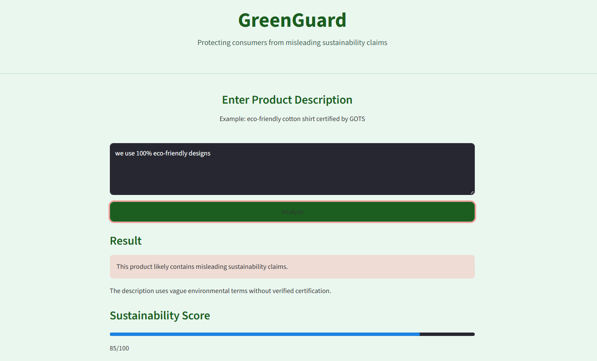
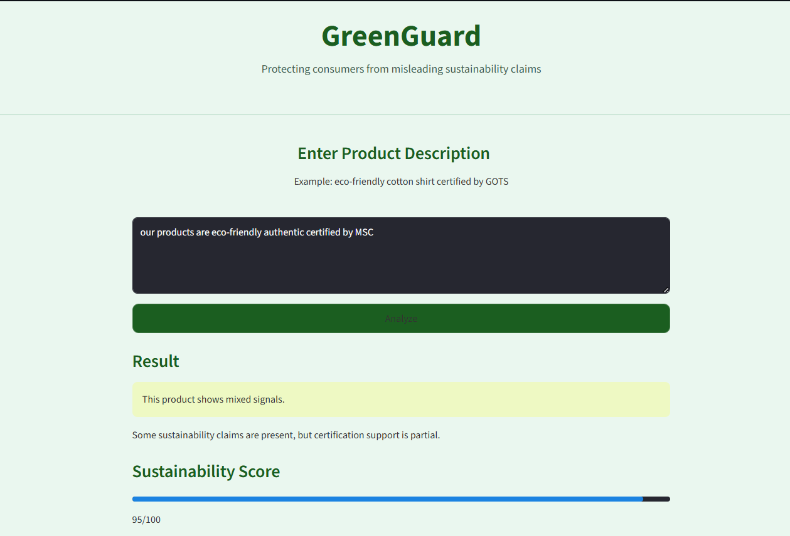
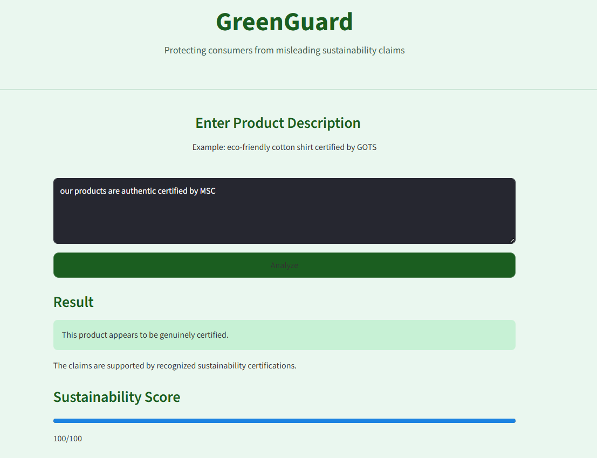

# 🌱 GreenGuard

GreenGuard is an AI-powered sustainability auditor that detects greenwashing in product descriptions.

## Features
- Detects vague environmental claims
- Validates certifications using dataset
- Provides sustainability score
- Clean user-friendly UI

## Tech Stack
- Python
- Streamlit
- Pandas

## How to Run

```bash
pip install streamlit pandas
streamlit run app.py

---

## Output






